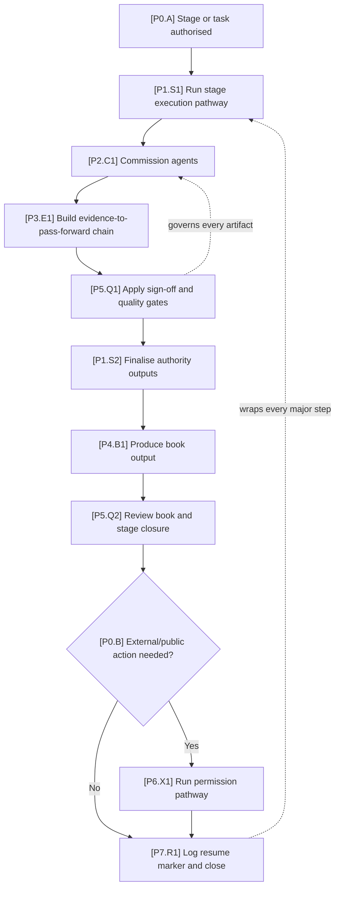
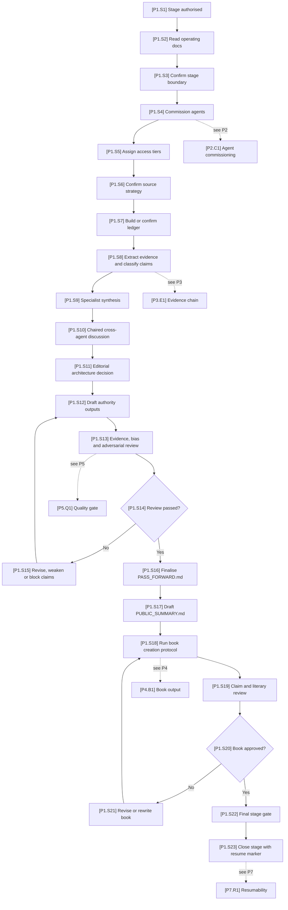
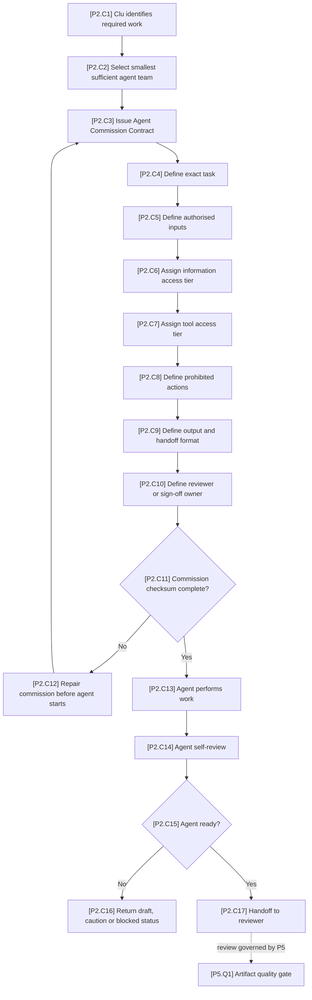
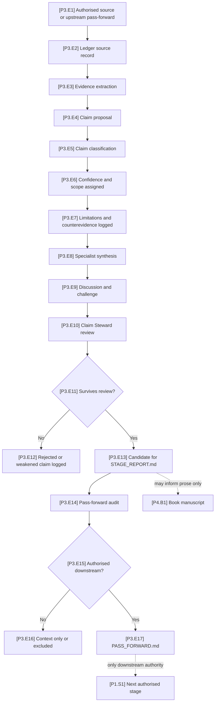
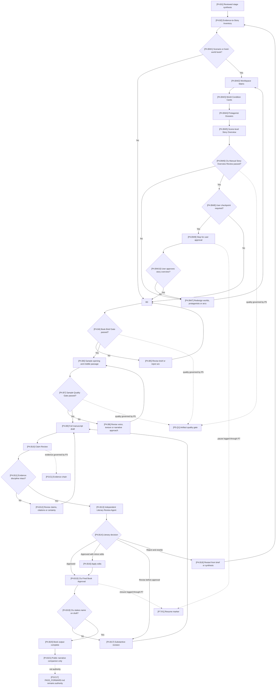
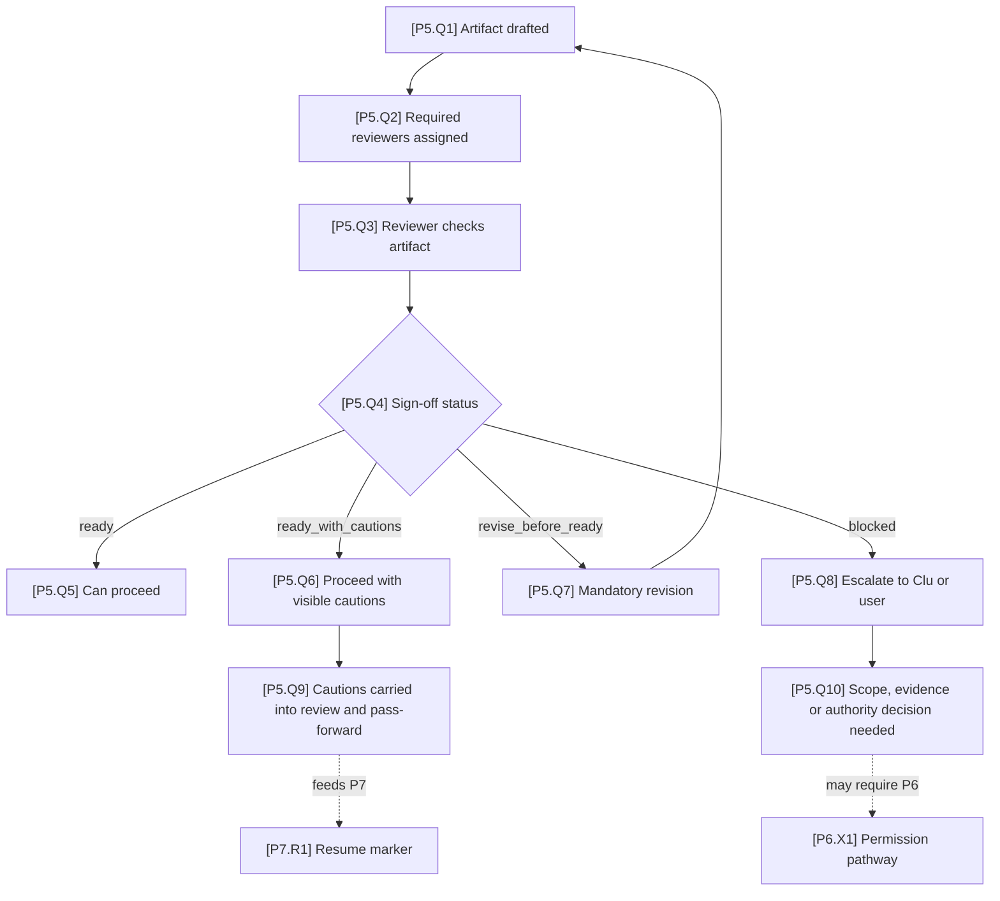
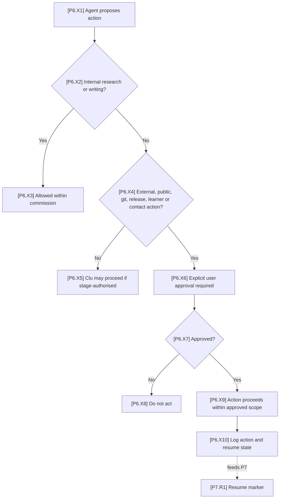
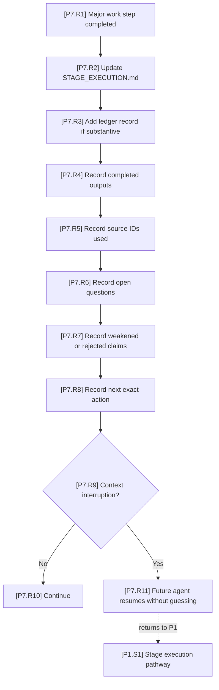

# Process Pathway Maps

This file visually maps the critical Year Zero operating pathways.

It is a reference companion to `AGENTS.md` and `docs/STAGE_ORCHESTRATOR_SOP.md`. It does not replace the SOP. If there is a conflict, the SOP governs.

The purpose of these maps is to make the organisation easier to audit, resume, explain and improve. They should help agents and human reviewers see where work enters the system, where claims gain authority, where quality gates apply and where user permission is required.

---

## 1. Diagram labelling standard

All pathway diagrams use the same label system so that charts can refer to one another clearly.

### 1.1 Pathway IDs

| Pathway ID | Pathway | Purpose |
|---|---|---|
| `P0` | Integrated Process Map | Shows how all pathway maps connect. |
| `P1` | Stage Execution Pathway | Shows the full route through a stage. |
| `P2` | Agent Commissioning Pathway | Shows how agents are scoped, authorised and reviewed. |
| `P3` | Evidence-to-Pass-Forward Pathway | Shows how evidence becomes authorised downstream claims. |
| `P4` | Book Output Pathway | Shows how reader-facing nonfiction is created and reviewed. |
| `P5` | Sign-Off and Quality Gate Pathway | Shows how artifacts move from draft to approved or blocked. |
| `P6` | External Authority and Permission Pathway | Shows when explicit user approval is required. |
| `P7` | Resumability Pathway | Shows how work is logged so later agents can resume. |

### 1.2 Node labels

Each node label uses this format:

```text
[PathwayID.NodeID] Human-readable action
```

Example:

```text
[P2.C3] Assign access tiers
```

The label means:

- `P2` = Agent Commissioning Pathway;
- `C3` = third major node in that pathway;
- the text after the code is the action.

### 1.3 Cross-chart references

When one chart zooms into a step from another chart, the source node is listed as a cross-reference.

Example:

```text
Zooms into: [P1.S3] Commission agents
Feeds back to: [P1.S4] Confirm source strategy
```

Mermaid diagrams are visual aids. The reliable links between charts are the headings, node IDs and cross-reference tables.

### 1.4 Status labels

Use the same status language across process maps, templates and review records:

| Status | Meaning |
|---|---|
| `draft` | Work exists but is not yet reliable. |
| `ready` | Work can be used for its intended purpose. |
| `ready_with_cautions` | Work can proceed only with visible cautions. |
| `revise_before_ready` | Work cannot proceed until specific revisions are made. |
| `blocked` | Work cannot proceed safely under current authority, evidence or access. |

### 1.5 Visual conventions

| Shape or edge | Meaning |
|---|---|
| Rectangle | Normal process step. |
| Diamond | Decision point. |
| Loop-back arrow | Revision, repair or retry route. |
| Dashed edge | Cross-pathway dependency or advisory connection. |
| “User approval required” node | Work cannot proceed autonomously. |

---

## 2. P0 — Integrated Process Map

This is the map of maps. Every detailed pathway below is a zoom-in on one or more nodes here.



### Cross-chart links

| P0 node | Detailed pathway |
|---|---|
| `[P1.S1] Run stage execution pathway` | [P1 — Stage Execution Pathway](#3-p1--stage-execution-pathway) |
| `[P2.C1] Commission agents` | [P2 — Agent Commissioning Pathway](#4-p2--agent-commissioning-pathway) |
| `[P3.E1] Build evidence-to-pass-forward chain` | [P3 — Evidence-to-Pass-Forward Pathway](#5-p3--evidence-to-pass-forward-pathway) |
| `[P4.B1] Produce book output` | [P4 — Book Output Pathway](#6-p4--book-output-pathway) |
| `[P5.Q1] Apply sign-off and quality gates` | [P5 — Sign-Off and Quality Gate Pathway](#7-p5--sign-off-and-quality-gate-pathway) |
| `[P6.X1] Run permission pathway` | [P6 — External Authority and Permission Pathway](#8-p6--external-authority-and-permission-pathway) |
| `[P7.R1] Log resume marker and close` | [P7 — Resumability Pathway](#9-p7--resumability-pathway) |

---

## 3. P1 — Stage Execution Pathway

**Zooms into:** `[P0.A] Stage or task authorised`  
**Calls:** P2, P3, P4, P5, P7  
**Governed by:** `docs/STAGE_ORCHESTRATOR_SOP.md`



### Cross-chart links

| P1 node | Links to |
|---|---|
| `[P1.S4] Commission agents` | [P2 — Agent Commissioning Pathway](#4-p2--agent-commissioning-pathway) |
| `[P1.S8] Extract evidence and classify claims` | [P3 — Evidence-to-Pass-Forward Pathway](#5-p3--evidence-to-pass-forward-pathway) |
| `[P1.S13] Evidence, bias and adversarial review` | [P5 — Sign-Off and Quality Gate Pathway](#7-p5--sign-off-and-quality-gate-pathway) |
| `[P1.S18] Run book creation protocol` | [P4 — Book Output Pathway](#6-p4--book-output-pathway) |
| `[P1.S23] Close stage with resume marker` | [P7 — Resumability Pathway](#9-p7--resumability-pathway) |

### Improvement checkpoints

- Check whether agent commissions were specific enough before work began.
- Check whether source collection was authorised or explicitly prohibited.
- Check whether the book arc was sketched after editorial architecture and before manuscript drafting.
- Check whether cautions from review were carried into `PASS_FORWARD.md`.

---

## 4. P2 — Agent Commissioning Pathway

**Zooms into:** `[P1.S4] Commission agents`  
**Feeds back to:** `[P1.S5] Assign access tiers`, `[P1.S9] Specialist synthesis`, `[P1.S13] Review`



### Commission checksum

No commissioned agent should begin work unless these fields are filled:

| Required field | Why it matters |
|---|---|
| Exact task | Prevents elegant but irrelevant work. |
| Authorised inputs | Prevents invented context and source drift. |
| Information access tier | Prevents over-reading and hidden dependency sprawl. |
| Tool access tier | Prevents unauthorised mutation or external action. |
| Prohibited actions | Prevents predictable boundary mistakes. |
| Required handoff | Prevents unusable informal summaries. |
| Reviewer / sign-off owner | Prevents self-approval. |

### Cross-chart links

| P2 node | Links to |
|---|---|
| `[P2.C6] Assign information access tier` | [P6 — External Authority and Permission Pathway](#8-p6--external-authority-and-permission-pathway), when access involves external systems |
| `[P2.C13] Agent performs work` | [P3](#5-p3--evidence-to-pass-forward-pathway), [P4](#6-p4--book-output-pathway) or [P5](#7-p5--sign-off-and-quality-gate-pathway), depending on commission |
| `[P2.C17] Handoff to reviewer` | [P5 — Sign-Off and Quality Gate Pathway](#7-p5--sign-off-and-quality-gate-pathway) |

---

## 5. P3 — Evidence-to-Pass-Forward Pathway

**Zooms into:** `[P1.S8] Extract evidence and classify claims`  
**Feeds:** `STAGE_REPORT.md`, `PASS_FORWARD.md`  
**Important boundary:** `STAGE_BOOK.md` may use reviewed synthesis, but it cannot authorise downstream claims.



### Cross-chart links

| P3 node | Links to |
|---|---|
| `[P3.E8] Specialist synthesis` | [P2 — Agent Commissioning Pathway](#4-p2--agent-commissioning-pathway) |
| `[P3.E10] Claim Steward review` | [P5 — Sign-Off and Quality Gate Pathway](#7-p5--sign-off-and-quality-gate-pathway) |
| `[P3.E13] Candidate for STAGE_REPORT.md` | [P1 — Stage Execution Pathway](#3-p1--stage-execution-pathway) |
| `[P3.E17] PASS_FORWARD.md` | Downstream stage authorisation |

### Improvement checkpoints

- Check whether any claim skipped ledger support.
- Check whether a claim moved from `context only` into `PASS_FORWARD.md` without review.
- Check whether the book uses a claim more strongly than `PASS_FORWARD.md` or `STAGE_REPORT.md` permits.

---

## 6. P4 — Book Output Pathway

**Zooms into:** `[P1.S18] Run book creation protocol`  
**Depends on:** reviewed synthesis from P3  
**Governed by:** independent literary review and claim discipline  
**Cannot feed:** downstream authority unless the claim is also in `PASS_FORWARD.md`



### Cross-chart links

| P4 node | Links to |
|---|---|
| `[P4.B1] Reviewed stage synthesis` | [P3 — Evidence-to-Pass-Forward Pathway](#5-p3--evidence-to-pass-forward-pathway) |
| `[P4.BW2] Worldspace Matrix` | [P3 — Evidence-to-Pass-Forward Pathway](#5-p3--evidence-to-pass-forward-pathway) and [P2 — Agent Commissioning Pathway](#4-p2--agent-commissioning-pathway) |
| `[P4.BW6] Clu Manual Story Overview Review passed?` | [P5 — Sign-Off and Quality Gate Pathway](#7-p5--sign-off-and-quality-gate-pathway) |
| `[P4.BW9] Stop for user approval` | [P7 — Resumability Pathway](#9-p7--resumability-pathway) |
| `[P4.B4] Book Brief Gate passed?` | [P5 — Sign-Off and Quality Gate Pathway](#7-p5--sign-off-and-quality-gate-pathway) |
| `[P4.B7] Sample Quality Gate passed?` | [P5 — Sign-Off and Quality Gate Pathway](#7-p5--sign-off-and-quality-gate-pathway) |
| `[P4.B10] Claim Review` | [P3 — Evidence-to-Pass-Forward Pathway](#5-p3--evidence-to-pass-forward-pathway) and [P5 — Sign-Off and Quality Gate Pathway](#7-p5--sign-off-and-quality-gate-pathway) |
| `[P4.B13] Independent Literary Review Agent` | [P2 — Agent Commissioning Pathway](#4-p2--agent-commissioning-pathway) |
| `[P4.B15] Clu Final Book Approval` | [P7 — Resumability Pathway](#9-p7--resumability-pathway) |
| `[P4.B21] Public narrative companion only` | [P3 — Evidence-to-Pass-Forward Pathway](#5-p3--evidence-to-pass-forward-pathway) |

### Improvement checkpoints

- The Book Evidence-to-Story Inventory and Book Brief must be created before full manuscript drafting.
- Scenario or lived-world books must pass the worldspace matrix, world condition card, protagonist dossier and story-overview checkpoint before prose drafting.
- If a user checkpoint is required, the stage must stop with a resume marker before full manuscript drafting.
- The Sample Quality Gate must pass before full manuscript drafting.
- The literary reviewer must not be the book writer.
- Approval by length, polish or completeness is not enough.
- Clu must reject the book if it is coherent but not genuinely reader-worthy.

---

## 7. P5 — Sign-Off and Quality Gate Pathway

**Applies to:** every artifact, agent handoff and major claim  
**Feeds:** P1 stage closure, P3 pass-forward approval, P4 book approval



### Cross-chart links

| P5 node | Links to |
|---|---|
| `[P5.Q2] Required reviewers assigned` | [P2 — Agent Commissioning Pathway](#4-p2--agent-commissioning-pathway) |
| `[P5.Q7] Mandatory revision` | Back to the relevant drafting pathway: P1, P3 or P4 |
| `[P5.Q8] Escalate to Clu or user` | [P6 — External Authority and Permission Pathway](#8-p6--external-authority-and-permission-pathway), where authority is required |
| `[P5.Q9] Cautions carried into review and pass-forward` | [P3 — Evidence-to-Pass-Forward Pathway](#5-p3--evidence-to-pass-forward-pathway) |

### Improvement checkpoints

- Use the same sign-off statuses everywhere.
- Check that `ready_with_cautions` actually carries cautions forward.
- Treat `blocked` as a real stop, not a rhetorical warning.

---

## 8. P6 — External Authority and Permission Pathway

**Applies to:** git, publishing, release, merge, public communication, external contact, learner-facing action and anything beyond the authorised workspace task.



### Cross-chart links

| P6 node | Links to |
|---|---|
| `[P6.X3] Allowed within commission` | [P2 — Agent Commissioning Pathway](#4-p2--agent-commissioning-pathway) |
| `[P6.X6] Explicit user approval required` | Clu / user decision |
| `[P6.X10] Log action and resume state` | [P7 — Resumability Pathway](#9-p7--resumability-pathway) |

### Improvement checkpoints

- If the action changes the outside world, assume explicit user approval is required.
- If the action only changes assigned workspace files within the authorised task, the agent may proceed under its tool tier.
- Git commit, push, merge, release and public publication are never implied by research completion.

---

## 9. P7 — Resumability Pathway

**Applies to:** every major step and every context-risky work session  
**Purpose:** prevent future agents from doing archaeology.



### Cross-chart links

| P7 node | Links to |
|---|---|
| `[P7.R2] Update STAGE_EXECUTION.md` | Stage execution file |
| `[P7.R3] Add ledger record if substantive` | `STAGE_LEDGER.csv` |
| `[P7.R8] Record next exact action` | Next relevant pathway node |
| `[P7.R11] Future agent resumes without guessing` | [P1 — Stage Execution Pathway](#3-p1--stage-execution-pathway) |

### Improvement checkpoints

- Every resume marker should include the next exact action.
- Resume markers should record weakened or rejected claims, not only completed work.
- If a stage is interrupted during review, the reviewer state must be recoverable.

---

## 10. Accessibility and maintenance notes

These diagrams are aids, not the only source of truth.

To keep them accessible:

- each diagram has a short prose explanation;
- every diagram node has a visible text label, not only a shape;
- every chart has a cross-reference table;
- decisions are named in plain language;
- the same terms are used in the SOP, templates and review gates.

To keep them maintainable:

- update this file when the SOP changes a pathway;
- preserve node IDs where possible so references do not break;
- if a node must be removed, note its replacement in the relevant cross-chart table;
- do not add decorative diagrams that do not clarify an operating decision.

---

## 11. Current known improvement candidates

These are lightweight improvements already reflected in the maps:

1. **Commission checksum** — agents should not begin until task, inputs, access, prohibitions, handoff and reviewer are explicit.
2. **Hardened book gates** — Book Evidence-to-Story Inventory, Book Brief Gate and Sample Quality Gate must happen before full manuscript drafting.
3. **Next exact action** — every resume marker should state exactly what the next agent should do.
4. **Book cannot bypass pass-forward** — `STAGE_BOOK.md` may explain claims, but downstream authority remains `PASS_FORWARD.md`.
5. **User approval boundary** — git, merge, release, publishing, external contact and learner-facing actions require explicit user approval.
